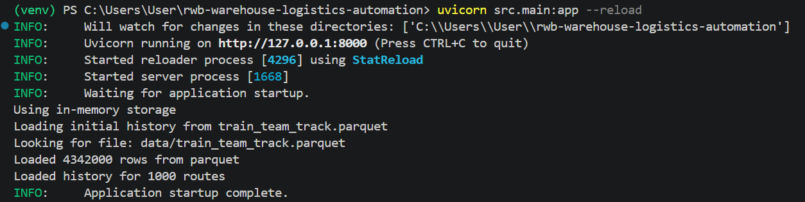
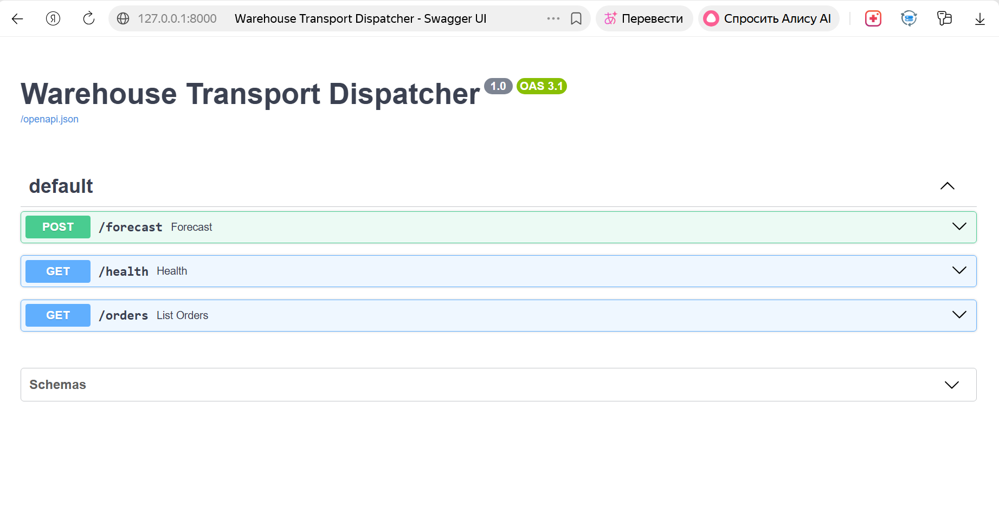
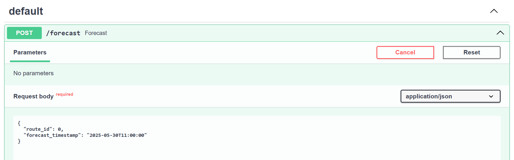
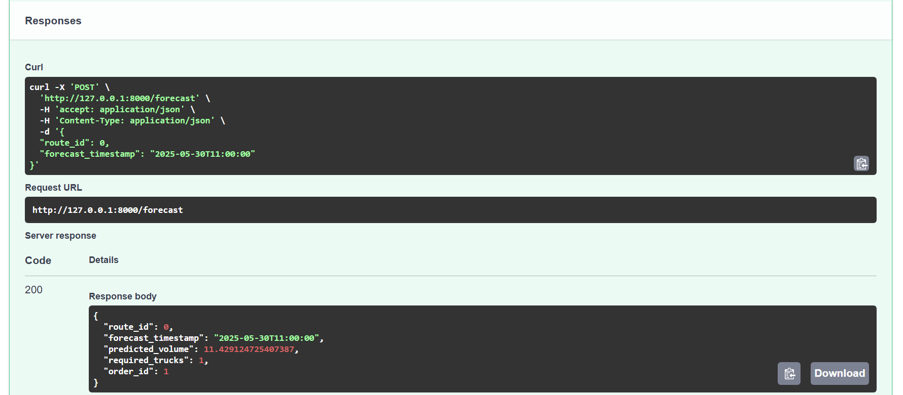
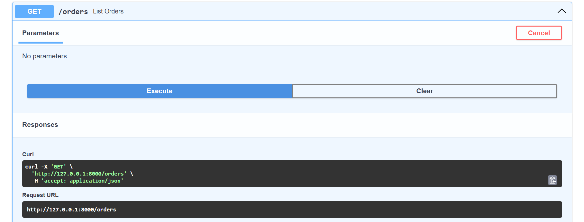
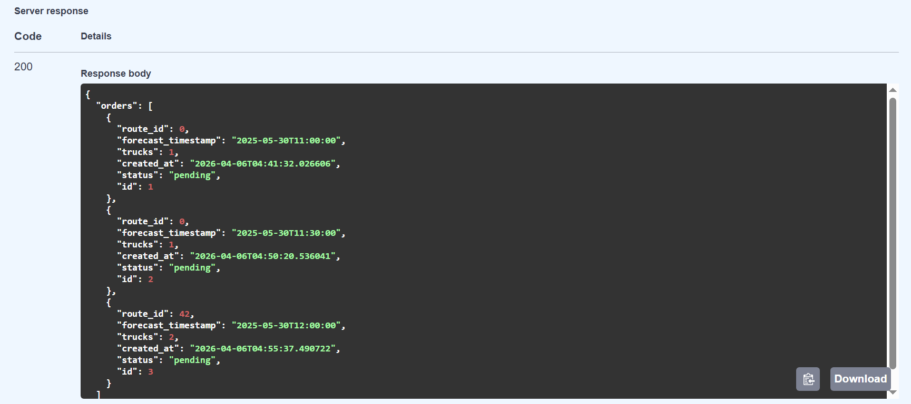

# Warehouse Transport Dispatcher

Система автоматического вызова транспорта для складов на основе прогноза отгрузок. Решение для командного трека Wildhack RWB.

## Основные возможности

- Прогнозирование объёма отгрузок (`target_2h`) на 2 часа вперёд для каждого маршрута.
- Расчёт необходимого количества машин с учётом бизнес-допущений (вместимость, коэффициент запаса).
- REST API на базе FastAPI с автоматической документацией Swagger.
- In-memory хранение истории и заявок (для простоты демонстрации).

## Метрика качества

Достигнутая метрика **WAPE + |Relative Bias| = 0.3637** на тестовом наборе данных.

## Бизнес-допущения

- Вместимость одной машины: **100 единиц** товара.
- Коэффициент запаса (safety factor): **1.2** (заказываем на 20% больше).
- Прогнозный горизонт: **2 часа** (соответствует целевой переменной `target_2h`).
- Статусы товаров в тестовом периоде неизвестны, поэтому используются последние известные значения из истории (фиксируются).
- Все маршруты независимы, транспорт вызывается отдельно для каждого маршрута.

## Архитектура решения

Компоненты:
- **FastAPI** – веб-сервер, предоставляющий API.
- **Feature builder** – модуль построения признаков (лаги, календарные) из истории.
- **Ансамбль моделей** – LightGBM, XGBoost, CatBoost.
- **Стекинг (Ridge)** – мета-модель, комбинирующая предсказания базовых моделей.
- **Dispatcher** – бизнес-логика: расчёт машин, создание заявок.
- **In-memory storage** – хранение истории и заявок (словари).

## Установка и запуск

### 1. Клонирование репозитория

```bash
git clone https://github.com/yuliagavrilova1111/warehouse-dispatcher.git
cd warehouse-dispatcher
```

### 2. Создание виртуального окружения и установка зависимостей

```bash
python -m venv venv
source venv/bin/activate      # Linux/Mac
venv\Scripts\activate         # Windows
pip install -r requirements.txt
```

### 3. Подготовка данных и моделей
- Поместите тренировочные данные `train_team_track.parquet` в папку `data/`.
- Поместите обученные модели в папку `models/`:  
  `lgb_model.pkl`, `xgb_model.pkl`, `cat_model.pkl`, `meta_model.pkl`, `features.json`, `cat_indices.json`.

### 4. Запуск сервера
```bash
uvicorn src.main:app --reload
```

После запуска вы увидите:



### 5. Проверка работоспособности
Откройте в браузере: http://127.0.0.1:8000/docs



## API Endpoints

| Метод   | Путь         | Описание                               |
|---------|--------------|----------------------------------------|
| GET     | `/health`    | Проверка состояния сервиса             |
| POST    | `/forecast`  | Получить прогноз и количество машин    |
| GET     | `/orders`    | Список всех созданных заявок           |

### Пример запроса `/forecast`

**Запрос:**

```json
{
  "route_id": 0,
  "forecast_timestamp": "2025-05-30T11:00:00"
}
```

**Ответ:**

```json
{
  "route_id": 0,
  "forecast_timestamp": "2025-05-30T11:00:00",
  "predicted_volume": 115.2,
  "required_trucks": 2,
  "order_id": 1
}
```





### Пример ответа `/orders`




### Запуск через Docker
```bash
docker build -t warehouse-dispatcher .
docker run -p 8000:8000 warehouse-dispatcher
```

### Пути развития продукта
- Добавление внешних данных: погода, праздники, пробки, рекламные акции – для повышения точности прогноза.
- Динамический коэффициент запаса: подбирать safety factor в зависимости от нестабильности прогноза.
- Интеграция с реальной системой заказа транспорта через API.
- Масштабирование: переход на распределённое хранилище (PostgreSQL, Redis) и горизонтальное масштабирование через балансировщик.
